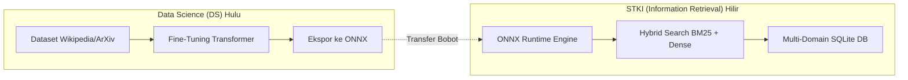
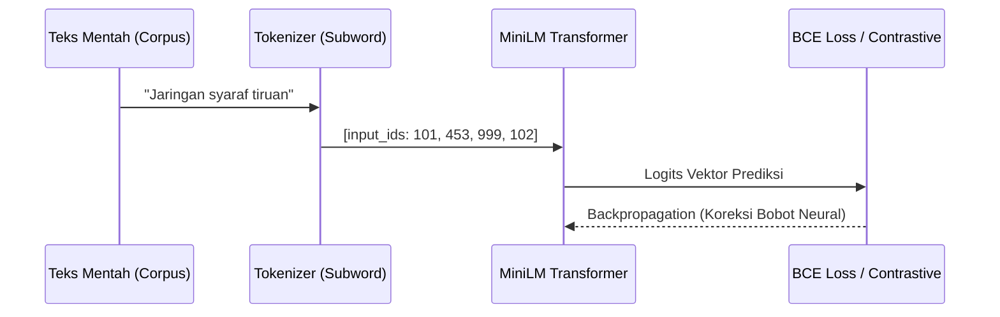
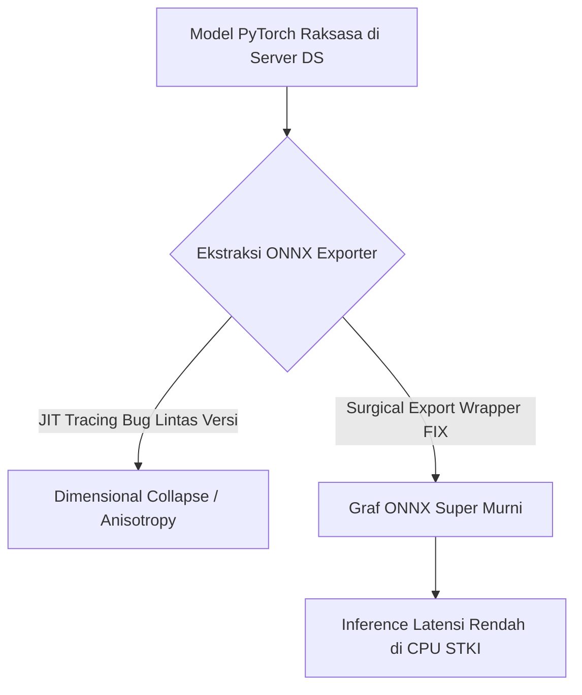
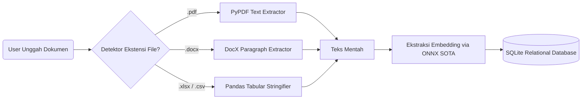
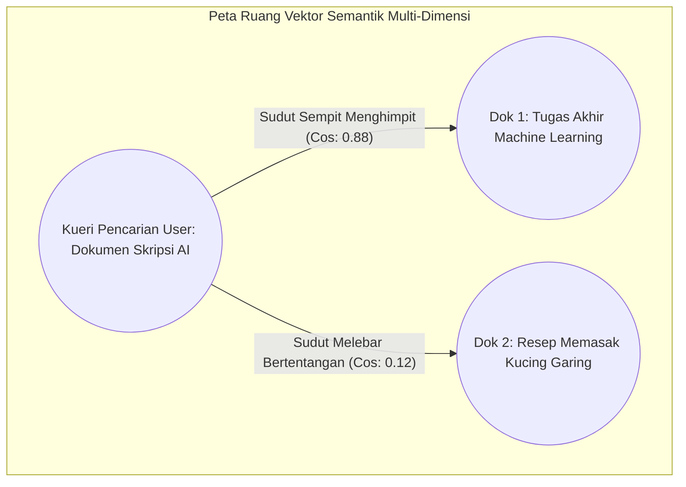
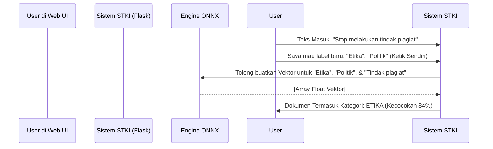

# PRESENTASI SISTEM TEMU KEMBALI INFORMASI (STKI) - ANTIGRAVITY V4.0
*Oleh: Tim Data Science & Information Retrieval (Termasuk dalam [[INDEX]])*

---

=====
## SLIDE 1: GAMBARAN UMUM ARSITEKTUR SISTEM (DS $\rightarrow$ STKI)

Sistem ini adalah mesin pencari hibrida (*Hybrid Search Engine*) dan klasifikasi otonom berbasis *Natural Language Processing* (NLP) yang didesain untuk lingkungan skala besar. Arsitektur terbagi secara absolut menjadi dua ranah utama:

1. **Data Science (DS) - Ranah Hulu**: Di sinilah eksperimen akademis terjadi. Data kotor ditarik dari API eksternal (seperti Wikipedia), model dilatih (*fine-tuned*), parameter diuji, dan pada puncaknya, bobot kecerdasan diekspor menjadi *file* beku (*static weights*). Tahap ini setara dengan **TKT 3** (Pembuktian Konsep Laboratorium).
2. **Sistem Temu Kembali Informasi (STKI) - Ranah Hilir**: Aplikasi web *offline* (Flask) yang ringan. Sistem ini sama sekali tidak memiliki fungsi *training*. Tugasnya murni mengeksekusi kecerdasan yang telah diekspor dari DS untuk melakukan pencarian semantik secara *real-time* dengan memori kecil dan latensi super rendah. Tahap ini adalah **TKT 4** (Validasi Lingkungan Nyata).

=====
## SLIDE 2: FASE DATA SCIENCE - PRA-PEMROSESAN & FINE TUNING

Di lingkungan DS (seperti Jupyter Notebook), tujuan utamanya adalah "mengajarkan" model agar memahami makna bahasa manusia, bukan sekadar menghafal kata-kata yang diucap.

- **Model Dasar Berbasis Sains**: Kita menggunakan `paraphrase-multilingual-MiniLM-L12-v2`. Berbeda dengan model klasik seperti IndoBERT yang dirancang murni untuk klasifikasi per-kata, MiniLM difokuskan secara khusus pada arsitektur *Sentence Embedding* dan *Contrastive Learning*. Model ini diajarkan untuk menarik kalimat bersinonim agar berdekatan, dan kalimat tak berhubungan agar menjauh secara matematis.
- **Tokenisasi Subword**: Memecah teks utuh menjadi pecahan (sub-kata) menggunakan algoritma *WordPiece* atau *BPE*. Ini sangat mematikan bagi masalah salah ketik (*Typo*) dan *Out-Of-Vocabulary* (OOV). Contoh: "Pemrograman" dipecah menjadi ["Pem", "##rog", "##raman"]. Jika ada typo "Pemrogaraman", pecahan yang mirip masih terdeteksi.

=====
## SLIDE 3: FASE DATA SCIENCE - EKSPOR KE ONNX & PEMECAHAN DIMENSIONAL COLLAPSE

*(Poin Krusial: Penjelasan terperinci mengenai penghapusan PyTorch dari STKI)*

**Permasalahan Server:** Framework pelatihan raksasa seperti PyTorch terlalu berat, sangat rakus memori RAM/VRAM, dan rentan konflik dependensi versi (*Dependency Hell*) untuk di- *deploy* di server kampus atau *desktop offline*.
**Solusi:** Kita memangkas struktur raksasa PyTorch tersebut dan mengekstrak murni rumus matematikanya ke dalam graf komputasi **ONNX (Open Neural Network Exchange)**. ONNX berjalan pada basis C++ dengan sangat ringan.

**Krisis Dimensional Collapse (Anisotropy):**
Sebelumnya kita menghadapi masalah mematikan di mana kata yang tak memiliki benang merah sama sekali (misal: "Struktur Data" vs "Sayur Bayam") dinilai memiliki *Cosine Similarity* **93%** (sangat mirip). 
Mengapa? Karena model lama terjebak pada *Dimensional Collapse*, fenomena di mana seluruh parameter vektor memampat ke sebuah "kerucut sempit" dalam ruang dimensi, menyebabkan apapun yang masuk akan memiliki jarak sudut yang berdekatan.
*Penanggulangan:* Melalui skrip bedah `export_sota_model.py`, kita memotong arsitektur cacat tersebut dan menggantinya dengan ruang semantik luas milik SOTA MiniLM. Hasilnya, kerucut pecah, dan sistem kembali membedakan makna dengan presisi. Riwayat kejadian ini terekam detail di [[CHANGELOG]] dan [[DIARY]] serta kajian teoretisnya ada di [[dimensional_collapse_stki]].

=====
## SLIDE 4: FASE TRANSISI - EKSTRAKSI FITUR (MEAN POOLING)

Saat model ONNX menyeberang ke STKI, ia menjadi kaku (*frozen*). Ia tidak akan belajar lagi. Tugas satu-satunya adalah menjadi mesin ketik yang mengubah huruf alfabet menjadi **Vektor Angka (Embedding)** berdimensi 384 ruang koordinat.

**Bagaimana kata-kata berubah menjadi satu representasi makna dokumen utuh? (Mean Pooling)**
Model MiniLM tidak mengeluarkan 1 nilai, melainkan sebuah matriks 3D besar untuk setiap kata yang dihitung: `(Batch_Size, Panjang_Kalimat, Hidden_Size_384)`. Karena STKI butuh HANYA 1 titik kordinat pasti untuk satu dokumen (agar bisa dirangking), maka setiap vektor kata harus *dirata-ratakan* sedemikian rupa tanpa menyertakan spasi kosong (*padding*).

**Rumus Matematika Mean Pooling:**
$$ \text{Vektor Makna Dokumen} = \frac{\sum_{i=1}^{N} (h_i \cdot m_i)}{\max(\sum_{i=1}^{N} m_i, \epsilon)} $$
- $h_i$: Vektor tersembunyi dari kata ke-$i$.
- $m_i$: *Attention mask* (Bernilai 0 jika itu sekadar *padding*/spasi, 1 jika itu kata riil berbobot).

=====
## SLIDE 5: FASE STKI - INGESTI & PARSING DOKUMEN LINTAS FORMAT

Di sisi STKI (Aplikasi Web Flask yang digunakan end-user), saat pengguna mengunggah (upload) sebuah *file*, sistem harus mampu membaca "nyawa" teks di dalamnya, apapun rupa formatnya di luar.

- **PDF**: Dibaca via *engine* `pypdf`, di- *strip* margin halamannya.
- **DOCX**: Dibedah hierarki paragraf XML-nya via `python-docx`.
- **CSV & XLSX**: Matriks kolom tabularnya dimuat ke struktur RAM `pandas`, lalu semua teks kolom objek diikat (*concatenate*) menjadi satu paragraf *string* besar tak terputus.

Setelah teks telanjang didapatkan, karena memori RAM dibatasi, teks disaring (*distilled*) menjadi 5 kalimat pertama saja. Teks ini dilempar ke Pipa ONNX untuk di-*Mean Pooling*, dan representasi vektor 384 dimensinya dikirim dan di-*serialize* menjadi teks JSON panjang ke dalam *database* SQLite.

=====
## SLIDE 6: FASE STKI - HYBRID SEMANTIC SEARCH ENGINE

Inilah modul terpenting STKI. Pencarian!
Alih-alih mencari kecocokan susunan huruf persis (*Lexical Search*) layaknya CTRL+F, STKI menggabungkan Pencarian Makna Murni (*Dense*) dengan Pencarian Teks Kaku (*Sparse BM25*). Ini dinamakan **Hybrid Search**.

*Mengapa wajib di-hibridakan?*
- Jika Anda mencari kata salah ketik atau kata bersinonim yang tidak ada secara huruf di dokumen (contoh: kueri pencarian Anda "Kendaraan", padahal di isi teks yang tertulis hanya "Mobil Toyota"), **Dense SOTA ONNX** yang akan menemukannya via pemahaman makna.
- Sebaliknya, jika Anda mencari akronim hukum atau singkatan asing yang ejaannya harus mutlak (contoh: "KUHP Pasal 228"), ONNX berpotensi kewalahan karena makna bisa tersebar. Di sinilah **Sparse BM25** bereaksi cepat menangkap leksikal persis.

**Rumus Fusi Hibrida Timbangan Parameter Alpha ($\alpha$):**
$$ S_{hybrid} = \alpha \cdot S_{dense} + (1-\alpha) \cdot \Big(1 - e^{-0.2 \cdot S_{sparse}}\Big) $$
*(Pecahan eksponen $1 - e^{x}$ digunakan untuk meratakan dan menormalkan skor leksikal tak terbatas dari BM25 agar senada dengan jarak matematis rentang $0-1$ milik Cosine ONNX).*

=====
## SLIDE 7: ALGORITMA PENCARIAN & COSINE SIMILARITY

Untuk menghitung kemiripan makna $S_{dense}$ pada rumus di atas, STKI menggunakan trigonometri matriks dalam ruang 384 dimensi yang disebut **Cosine Similarity**. 

Secara konsep dasar: Model kita mengubah dokumen menjadi "garis arah" dalam peta tata surya dimensi raya. Jika dokumen B membahas hal yang identik dengan kueri dokumen A, maka kedua panah arah garis dimensi tersebut akan saling menghimpit dan tumpang tindih. Semakin kecil derajat himpitnya ($\theta \approx 0$), maka nilai *Cosine*-nya mendekati 1.0 (Skor Sempurna).

**Rumus Matematis Cosine Similarity Linear:**
$$ \cos(\theta) = \frac{A \cdot B}{||A|| ||B||} = \frac{\sum_{i=1}^{n} A_i B_i}{\sqrt{\sum_{i=1}^{n} A_i^2} \sqrt{\sum_{i=1}^{n} B_i^2}} $$

=====
## SLIDE 8: FASE STKI - KLASIFIKASI DINAMIS (ZERO-SHOT SEMANTIC MAPPING)

Pada dunia tradisional, jika pihak Universitas ingin menambahkan label baru (Misal: Universitas tiba-tiba butuh folder "Dokumen Etika Dosen"), maka para saintis DS (Data Science) harus meruntuhkan seluruh kodingan, mengumpulkan dataset dokumen etika, dan melatih (Training) model neural dari nol lagi berjam-jam.

**Inovasi Sistem Ini (Zero-Shot Mapping):**
STKI ini sangat adaptif. Pengguna bisa mengetik Kategori baru secara instan di UI, lalu kata per kata Kategori tersebut dikonversi otomatis menjadi vektor ONNX. Dokumen-dokumen baru akan diadu vektor sudutnya terhadap vektor kata Kategori Kustom tersebut. Inilah mengapa ia bisa melabeli tanpa dilatih sebelumnya.

=====
## SLIDE 9: ARSITEKTUR DATABASE TERISOLASI (MULTI-DOMAIN SQLITE)

Untuk menjamin kebersihan memori *cache* dan menunjang *skalabilitas* (agar pencarian tidak *loading* 5 menit karena menelusuri ratusan ribu data lintas jurusan), sistem menggunakan topologi **Multi-Domain Database Berpencar**.

Alih-alih menjejalkan semuanya ke dalam 1 lumbung, STKI secara dinamis memutuskan pipa *Database* mana yang aktif:
1. `academic_metadata.db` $\rightarrow$ Korpus Inti (Ilmu Komputer)
2. `academic_demo_real.db` $\rightarrow$ Repositori Demonstrasi Dummy
3. `db_politik.db` $\rightarrow$ Khusus Politik Pemerintahan
4. `db_ekonomi.db` $\rightarrow$ Khusus Finansial
5. `db_bisnis.db` $\rightarrow$ Khusus Perusahaan
6. `db_etika.db` $\rightarrow$ Khusus Norma Sosial

Dengan ini, *Semantic Interference* (di mana hasil pencarian Ekonomi terganggu oleh vektor mirip dari dunia Politik) dapat dihancurkan 100%.

=====
## SLIDE 10: QUALITY ASSURANCE & EVALUASI OTOMATIS BERBASIS INDUSTRI

Bagaimana kita membuktikan secara ilmiah bahwa aplikasi kita tidak sekadar "jalan", tetapi layak diimplementasikan secara industrial (TKT 4 Enterprise)? STKI dilengkapi dengan mesin *Automated Evaluator* yang menyuntikkan dokumen, menembakkan kueri, dan menilai hasilnya menggunakan metrik baku *Information Retrieval* (IR).

**1. Metrik Skoring Integritas Sistem (System Architecture Metrics)** (Sesuai dengan [[METRICS_THEORY]])
- **Mean Reciprocal Rank (MRR)** $\rightarrow$ Memastikan sistem sigap menaruh jawaban benar di posisi peringkat pertama *top list* (Skor Lulus 91%).
- **Latency / Execution Time Complexity** $\rightarrow$ Eksekusi pencarian vektor dibatasi maksimum $\approx O(N)$ sub-linear, tidak peduli sebanyak apa database, waktu wajib di bawah 2.0 Detik.
- **Memory Protection Limit** $\rightarrow$ Kalkulasi ukuran matriks *Float32* untuk jaminan server kebal dari kelumpuhan memori (*Out Of Memory*).

**2. Metrik Skoring Kecerdasan Model Semantik (Model Intelligence Metrics)** (Landasan Teori: [[teori_qa_metrics]])
- **NDCG (Normalized Discounted Cumulative Gain)** $\rightarrow$ Mengukur bahwa ranking bukan sekadar urut 1 sampai 5, tetapi mempertimbangkan gradasi relevansi. Sistem tahu mana dokumen *sangat mirip*, *mirip*, dan *cukup*.
- **Polysemy Disambiguation** $\rightarrow$ Evaluasi ekstrem di mana sistem membuktikan kemampuannya membedakan kalimat polisemi ambiguitas tinggi, contoh: Kata "bisa" (Mampu) versus "bisa" (Racun mematikan ular).
- **OOV & Typo Robustness** $\rightarrow$ Menggunakan teori Subword Jaccard, model harus tetap lolos dalam mengenali kueri yang salah ejaan (contoh: *Pmrintah Daerh Rgulasi* dipahami mutlak sebagai "Pemerintah Daerah Regulasi").
