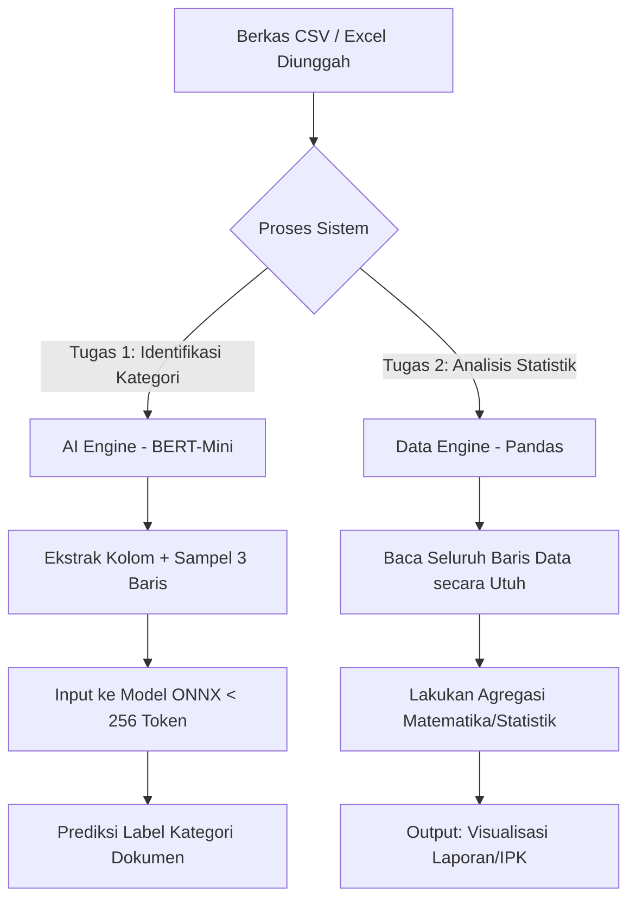

# Arsitektur Pemrosesan Dokumen & Limitasi Model STKI

**Dokumen Fondasi Akademik - Spesifikasi Rekayasa Sistem**

Dokumen ini menjelaskan keputusan arsitektur sistem dalam pemrosesan dokumen berskala besar, batasan teknis model Transformer (`BERT-Mini`), serta pembagian kerja hibrida antara AI Classifier dengan Data Engine.

---

## 1. Mengapa BERT-Mini Dibatasi Maksimal 256 Token?

Dalam implementasi sistem ini, teks masukan yang dikirim ke model BERT-Mini dipotong (_truncated_) maksimal sepanjang **$L = 256$ token**. Keputusan ini didasarkan pada batasan teoretis arsitektur Transformer:

### A. Kompleksitas Kuadratis Self-Attention ($O(L^2)$)

Mekanisme utama dari BERT adalah _Self-Attention_, di mana setiap token kata membandingkan dirinya dengan seluruh token lain di dalam teks untuk memahami konteks. Secara matematis, biaya komputasi dan penggunaan memori RAM/VRAM berskala secara kuadratis terhadap panjang urutan teks ($L$):

$$\text{Complexity} = O(L^2 \cdot d)$$

- Di mana $L$ adalah panjang sekuens (jumlah token) dan $d$ adalah dimensi tersembunyi model (_hidden dimension_).
- Jika panjang token dinaikkan dari $256$ menjadi $1024$ (naik $4$ kali lipat), maka beban komputasi dan memori tidak naik $4$ kali, melainkan naik **$16$ kali lipat** ($4^2$).
- **Sumber Referensi:** _Vaswani et al., 2017 (Attention Is All You Need)_ & _Devlin et al., 2018 (BERT: Pre-training of Deep Bidirectional Transformers)_.

### B. Limitasi Arsitektur BERT

- Model dasar BERT memiliki batas keras mutlak sebesar **$512$ token**. Model tidak dapat memproses sekuens lebih dari itu karena matriks posisi embedding (_positional encoding_) yang dilatih saat pembuatan model hanya berukuran $512$.
- Pada sistem lokal/offline, batasan **$256$ token** dipilih sebagai kompromi optimal untuk menjaga kecepatan inferensi CPU di bawah 1 detik per dokumen dengan tetap menangkap seluruh ringkasan/abstrak dokumen (rata-rata abstrak jurnal adalah $150-200$ kata).

---

## 2. Mengapa Memasukkan Berkas Penuh (Full Text) secara Langsung Tidak Layak?

Jika seluruh isi dokumen penuh (misalnya berkas PDF skripsi 50 halaman atau file CSV berisi 10.000 baris data mahasiswa) dimasukkan langsung ke model AI:

1.  **Memory Overflow (Out Of Memory / OOM):** Sistem lokal CPU/GPU akan kehabisan memori untuk mengalokasikan matriks perhatian (_attention matrix_) yang sangat besar.
2.  **Catastrophic Truncation:** Model BERT akan memotong paksa teks tersebut tepat pada token ke-256 (atau 512) dan membuang sisa halaman di belakangnya. Jika informasi penting pembentuk label berada di halaman tengah atau akhir, model tidak akan pernah membacanya.
3.  **Noise & Degradasi Akurasi:** Teks yang terlalu panjang mengandung banyak _noise_ (kata-kata pelengkap). Memasukkan seluruh teks akan mengaburkan sinyal kata kunci penting, menyebabkan nilai kemiripan kosinus runtuh (_representation collapse_).

---

## 3. Solusi Sistem: Pembagian Kerja Hibrida (Hybrid Processing)

Untuk mengatasi limitasi di atas, sistem STKI ini menerapkan pembagian tugas yang jelas antara **Kecerdasan Buatan (AI)** dan **Mesin Pengolah Data (Pandas Engine)**:



### A. Alur Kerja AI Engine (BERT-Mini + Cosine Similarity)

- **Cara Kerja:** Untuk berkas tabel (`.csv`/`.xlsx`), parser mengekstrak nama kolom dan nilai dari 3 baris pertama menjadi satu string deskriptif singkat.
- **Contoh Representasi:**
  `"Dokumen spreadsheet tabel. Kolom: NIM, Nama, Semester, Nilai. Data: Baris 1: NIM: 10123001 | Nama: Budi ..."`
- **Alasan Efektif:** Nama kolom dan contoh baris sudah mewakili "struktur genetik" dari tabel tersebut. Model BERT dapat langsung menyimpulkan tipe dokumen tersebut adalah berkas akademik tanpa harus membaca 10.000 baris data di bawahnya.

### B. Alur Kerja Data Engine (Pandas)

- **Cara Kerja:** Ketika pengguna memilih fitur transformasi data (seperti menghitung perkembangan IPK mahasiswa), backend akan memproses file secara lokal menggunakan pustaka Python `Pandas`.
- **Alasan Efektif:** Pandas memproses file secara efisien di memori sebagai tabel terstruktur (_DataFrame_), membaca jutaan baris data dalam milidetik secara matematis murni (tanpa melalui jaringan saraf tiruan AI), menghasilkan perhitungan kuantitatif yang $100\%$ akurat.

---

## 4. Pipeline Preprocessing Teks (Tahapan Pra-Pemrosesan)

Sebelum teks dokumen diumpankan ke model BERT-Mini, sistem menjalankan pipeline preprocessing berlapis yang memastikan kualitas representasi semantik optimal. Setiap tahap dijalankan secara sekuensial:

### A. Case Folding (Normalisasi Huruf)
Seluruh teks dikonversi ke huruf kecil menggunakan operasi `text.lower()` untuk menghilangkan perbedaan case yang tidak relevan secara semantik. Tahap ini memastikan kata `"Transkrip"`, `"TRANSKRIP"`, dan `"transkrip"` diperlakukan identik oleh BM25 dan mesin pencocokan kata kunci.

### B. TextRank Key-Sentence Extraction (Peringkasan Ekstraktif)
Untuk dokumen panjang (> 5 kalimat), algoritma TextRank (Mihalcea & Tarau, 2004) digunakan untuk mengekstrak $N$ kalimat paling representatif berdasarkan sentralitas graf. Tahap ini mengatasi limitasi pemotongan 256 token BERT dengan memastikan kalimat yang paling informatif dipertahankan.

### C. WordPiece Tokenization (BERT Tokenizer)
Teks yang sudah diringkas dipecah menjadi sub-kata (*subword tokens*) menggunakan WordPiece Tokenizer dari HuggingFace. Tokenizer ini secara implisit menangani:
- **Stemming/Lemmatization**: WordPiece memecah kata asing menjadi morfem bermakna (misal: `"perkuliahan"` → `["per", "##kuliah", "##an"]`)
- **Out-of-Vocabulary (OOV) Handling**: Kata yang tidak dikenal dipecah menjadi sub-unit karakter yang tetap memiliki representasi vektor

### D. Padding & Truncation
Token yang dihasilkan di-_pad_ hingga panjang tetap $L = 256$ menggunakan token `[PAD]`, atau dipotong jika melebihi batas. Attention mask digunakan untuk memastikan token padding diabaikan oleh mekanisme Self-Attention BERT.

### E. Embedding Extraction (Mean Pooling)
Output hidden states dari layer terakhir BERT dirata-ratakan menggunakan Mean Pooling untuk menghasilkan satu vektor representasi semantik berdimensi tetap per dokumen.

```
Raw Text → Case Folding → TextRank Extraction → WordPiece Tokenization → Padding/Truncation (256) → BERT Embedding → Mean Pooling → Vektor Semantik
```

---

## 5. Arsitektur Evaluasi Performa Sistem STKI

Untuk memenuhi standar evaluasi akademis IR modern, sistem menyediakan dua jenis evaluasi:

### A. Evaluasi Klasifikasi (Label Prediction)
Menguji akurasi pelabelan dokumen dengan membandingkan prediksi sistem terhadap ground truth menggunakan metrik:
- **Confusion Matrix** (TP, FP, TN, FN per label)
- **Precision & Recall** (positif dan negatif)
- **F1-Score** (positif dan negatif)
- **Accuracy** keseluruhan

### B. Evaluasi Pencarian (Retrieval Quality)
Menguji kualitas peringkat hasil pencarian berdasarkan kueri pengguna menggunakan metrik:
- **Precision@K**: Proporsi dokumen relevan di Top-K
- **MAP (Mean Average Precision)**: Rata-rata presisi kumulatif atas seluruh kueri
- **NDCG@K**: Kualitas urutan peringkat dengan penalti posisi logaritmik

Kedua jenis evaluasi ini dijalankan menggunakan **minimal 10 kueri pengujian** dengan konteks berbeda, sesuai ketentuan proyek akhir STKI.
