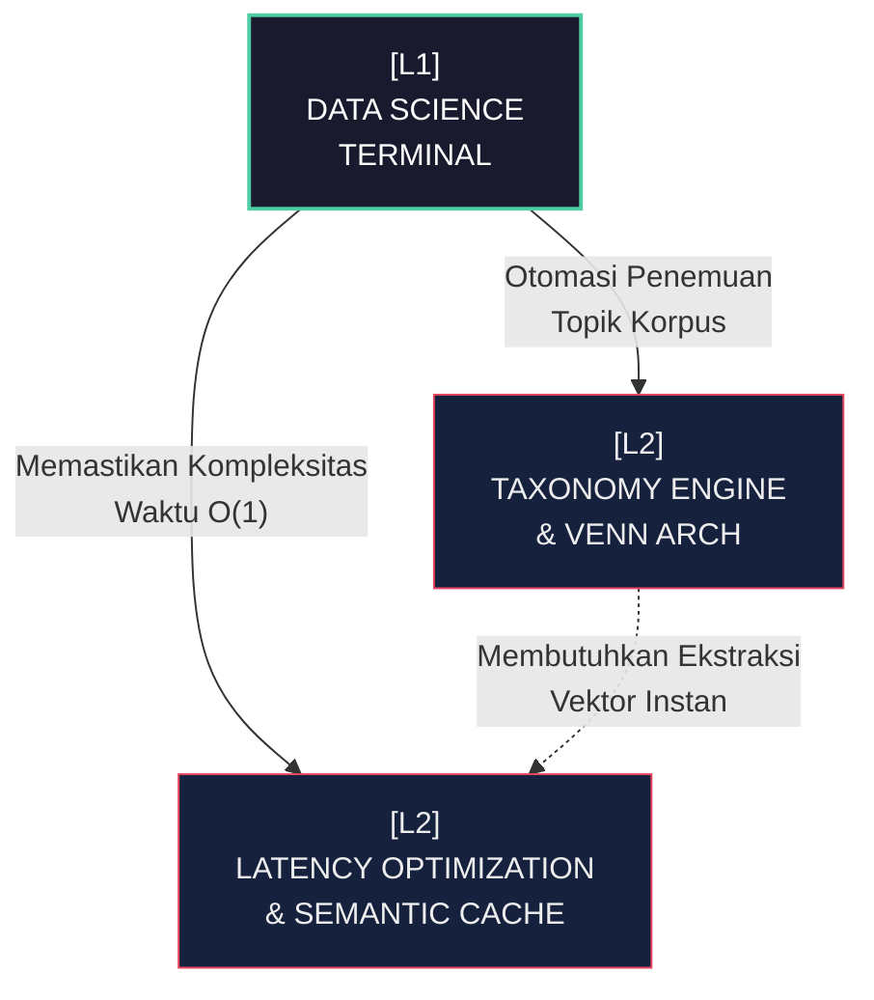

# [L1] DATA SCIENCE ARCHITECTURE: TAXONOMY & TELEMETRY

Ruang *Data Science* dalam sistem STKI bertindak sebagai *Command Center* analitik dan orkestrasi taksonomi korpus. L1 ini tidak sekadar menyediakan antarmuka visualisasi statis, melainkan mengaktifkan ekosistem inferensi *Open Machine Learning* (OML) murni yang berjalan di atas topologi memori yang diselaraskan dengan metrik performa. Paradigma desain di sini menolak keras sistem klasterisasi manual yang *rigid* (pelabelan statis paksa). Pendekatan yang diadopsi adalah otonomi penemuan tema berbasis *Unsupervised Learning* terdistribusi yang diregulasi oleh hukum pembatas entropi informasi matematis (*Rice Rule*). Seluruh proses dirancang dengan visibilitas ekstrem terhadap deviasi spasial dokumen di dalam ruang vektor hiper-dimensional.

Struktur tingkat tinggi dari *Data Science Terminal* berpusat pada optimalisasi aliran data di mana beban komputasi besar seperti *K-Means* matriks TF-IDF dan kalkulasi *Venn-Intersection Thresholding* dipaksa beroperasi dalam *pipeline* satu arah yang membatasi repetisi akses disk. Pendekatan ini sangat bergantung pada doktrin "Server Memory-Safe First", meminimalisir interupsi dari *garbage collector* lokal bahasa interpreter dengan mendelegasikan iterasi agregasi kepada lapisan mesin di bawahnya. Visualisasinya dibentuk dalam *Neobrutalist Accordion* yang menekankan taktil navigasi tanpa mengorbankan kecepatan transisi DOM.

| Dimensi | Deskripsi Teknis | Dampak Arsitektural |
| :--- | :--- | :--- |
| **Kalkulasi Klaster** | Agregasi K-Means murni dengan matriks kepadatan spasial (*Centroid Density*). | Mengubah *raw* dokumen menjadi taksonomi interaktif terstruktur secara otonom dalam skala detik. |
| **Pengelolaan Outlier** | *Algorithmic Fallback* bagi node dokumen dengan kemiripan batas irisan $\tau < 0.50$. | Mencegah polusi entropi dalam taksonomi inti dengan membatasi pemaksaan ekuivalensi semantik. |
| **Doktrin Latensi** | Pemanfaatan *In-Memory Database Connection* dan *Lazy Loading* elemen DOM di Terminal UI. | Memastikan bahwa matriks telemetri multi-label terender seketika tanpa fenomena *UI Freezes* selama navigasi puluhan ribu titik data. |

Sistem ini memecah dirinya ke dalam dua lengan operasional L2 yang fundamental. Lengan pertama adalah Mesin Taksonomi (*Taxonomy Engine*) yang bertanggung jawab atas komputasi batas irisan multi-label. Lengan kedua memfokuskan sepenuhnya pada Rekayasa Latensi (*Latency Optimization*), di mana semua kalkulasi besar dibekukan dan dialirkan melalui saluran vektor yang di-*bypass* untuk menghasilkan kinerja matriks memori instan.

**Keterhubungan Graf (L2 Sub-Systems):**
- [[L2_TAXONOMY_ENGINE]]
- [[L2_LATENCY_OPTIMIZATION]]

---
*Konteks: Akar Hierarki Terminal Data Science.*
