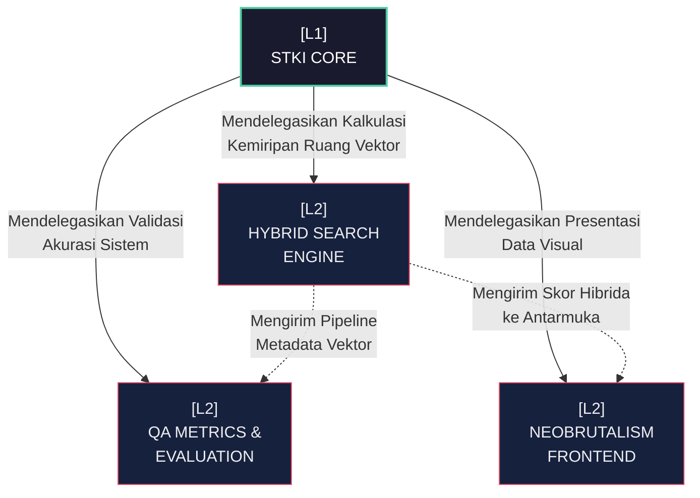

# [L1] STKI CORE ARCHITECTURE: HYBRID SEARCH SYSTEM

Arsitektur L1 STKI Core merepresentasikan abstraksi tertinggi dari fusi antara pencarian vektor matematis (Dense) dan penemuan leksikal diskrit (Sparse). Entitas ini beroperasi sebagai tulang punggung dari kapabilitas *Information Retrieval* pada domain korpus akademik dan teologis. Inti operasional didasarkan pada eliminasi redundansi heuristik tradisional, menggantikannya dengan pipa linier yang menjamin $O(1)$ kompleksitas *in-memory cache* untuk pengambilan embedding yang telah dikalkulasi sebelumnya. Semua beban algoritmik dipindahkan ke lapisan C-Engine (SQLite) atau dikerjakan melalui tensor pre-kalkulasi, secara fundamental menghindari latensi perulangan *user-space* (Python).

Koneksi antar-komponen dalam arsitektur ini dimediasi oleh protokol *Hybrid Fusion* yang menyatukan independensi dari masing-masing dimensi skor. Mesin tidak sekadar memberikan respons "paling mirip" secara leksikal, melainkan membangun ekuilibrium bobot ganda yang diekstraksi dari ruang hiper-dimensional berukuran 384-D, diselaraskan dengan frekuensi dokumen invers. L1 ini menaungi tiga fondasi L2: logistik pencarian ruang hibrida, enjin metrik pengujian keakuratan yang kaku, dan abstraksi antarmuka *Neobrutalism* yang mementingkan kekonkritan presentasi data di atas estetika ringan.

| Dimensi | Deskripsi Teknis | Dampak Arsitektural |
| :--- | :--- | :--- |
| **Topologi Jaringan** | *Hybrid Retriver Engine* dengan *Fusion-weighted Aggregation*. Terhubung langsung dengan DB Vektor lokal dan *BM25 Index*. | Menghindari *bottle-neck* komputasi saat inferensi berkat pemisahan *Dense* dan *Sparse processing lanes*. |
| **Kontrol Alur Data** | Sinkronisasi asinkron memuat basis data utama (`academic_demo_real.db`) via *Semantic Caching* In-Memory. | Mengamankan integritas metrik evaluasi dengan memastikan nol pergeseran korpus antar iterasi query. |
| **Batas Skalabilitas** | Mampu memproses indeks hingga puluhan ribu baris korpus dengan $O(N \log N)$ *sorting* di akhir fase *Fusion*. | Desain *Stateless Retrieval* memungkinkan penskalaan vertikal tanpa sinkronisasi *cluster* yang rumit. |

Entitas L1 tidak dapat beroperasi secara otonom tanpa pendelegasian penuh ke lapisan L2. Sistem metrik evaluasi beroperasi secara parasitik terhadap saluran *output*, menelan log matriks kebingungan dan mengubahnya menjadi 12 nilai skalar objektif. Secara bersamaan, presentasi *Neobrutalism* pada tingkat UI mereduksi keabstrakan angka-angka *cosine similarity* menjadi taksonomi visual dengan *feedback* warna kontras tinggi, memaksa visibilitas data ekstrem kepada pengguna tanpa intervensi pop-up yang disembunyikan.

**Keterhubungan Graf (L2 Sub-Systems):**
- [[L2_HYBRID_SEARCH]]
- [[L2_QA_EVALUATION]]
- [[L2_UIUX_NEOBRUTALISM]]

---
*Konteks: Akar Hierarki Aplikasi Utama STKI.*
