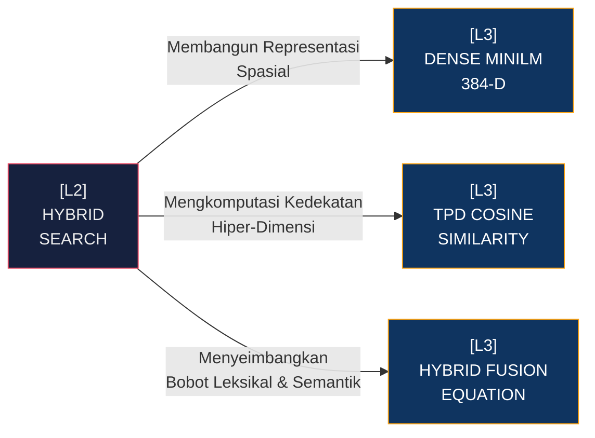

# [L2] SUB-SYSTEM: HYBRID SEARCH ENGINE

Sub-sistem *Hybrid Search Engine* merupakan representasi konkrit dari pendelegasian komputasi kemiripan tingkat lanjut yang bernaung di bawah [[L1_STKI_CORE]]. Modul ini menolak paradigma pencarian biner (cocok atau tidak cocok) konvensional dengan mengawinkan dua topologi penemuan informasi yang fundamental: penemuan fitur leksikal berbasis *Term Frequency-Inverse Document Frequency* yang dioptimasi via skema probabilitas BM25, dan komputasi representasi geometris dari ruang semantik yang digenerasi oleh model bahasa tersembunyi (Dense Vector 384-D). Penyatuan ini menjamin sistem tidak buta terhadap variasi parafrasa namun tetap sensitif terhadap *keyword* teknis ekstrem yang seringkali meredup dalam rata-rata vektor Dense.

Arsitekturnya dimodelkan agar beroperasi secara nir-status (*stateless*) pada *layer* aplikasi. Saat kueri dimasukkan, sistem meluncurkan dua *pipeline* perhitungan secara asinkron (pada sistem terdistribusi) atau multi-utas (*multi-threaded*). Normalisasi Min-Max diterapkan pada kedua vektor probabilitas sebelum sistem menjalankan fusi $\alpha$-*weighted* guna memastikan tidak ada metrik yang mendominasi anomali skala absolut.

| Dimensi | Deskripsi Teknis | Dampak Arsitektural |
| :--- | :--- | :--- |
| **Pipeline Leksikal** | Pengindeksan fitur teks langka via *Sparse Inverted Index* (Algoritma BM25). | Penemuan *Exact Match* pada terminologi N-Gram teknis tanpa latensi ekstraksi graf. |
| **Pipeline Semantik** | Pengukuran jarak kosinus di dalam representasi matriks Dense 384-D dari ONNX *MiniLM Runtime*. | Penemuan asosiasi semantik laten (parafrasa tingkat tinggi) di luar batasan irisan literal N-Gram. |
| **Normalisasi Hibrida** | Penyesuaian skala *Min-Max* ke rentang uniter $[0,1]$ yang ditutup dengan *Fusion Equation*. | Mencegah distorsi metrik antara skala logaritmik probabilistik (BM25) dan batas uniter geometris (*Cosine*). |

Kelemahan inheren dari vektor rata-rata sub-kata (Dense) adalah fenomena *Dimensional Collapse*, di mana distingsi halus antar korpus berdekatan menjadi kabur. Hybrid Engine mensubstitusi kelemahan ini dengan bertumpu pada ketajaman *Sparse Matrix*. Implementasi teknis dari sub-sistem ini wajib mematuhi aturan matematika ketat dalam normalisasi skor yang didelegasikan lebih lanjut ke entitas L3 spesifik.

**Keterhubungan Graf (L3 Deep Dive Nodes):**
- [[L3_THEORY_DENSE_MINILM]]: Teori Vektorisasi ONNX & Arsitektur Jaringan.
- [[L3_PRACTICE_TPD_COSINE]]: Logika & Kode Kalkulasi Sudut Vektor $\theta=0.92$.
- [[L3_PRACTICE_HYBRID_FUSION]]: Logika Penyatuan Skala Normalisasi Min-Max $\alpha=0.70$.

---
*Konteks: Bagian dari [[L1_STKI_CORE]]*
