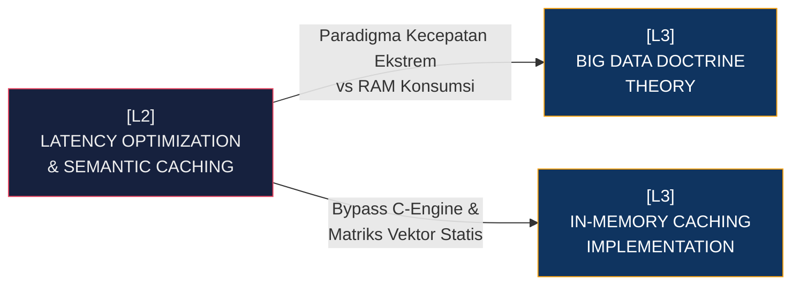

# [L2] SUB-SYSTEM: LATENCY OPTIMIZATION & SEMANTIC CACHING

Modul ini adalah jantung optimasi performa *Information Retrieval* yang terlahir dari filosofi *BIG DATA Doctrine*, bernaung di dalam struktur [[L1_DATA_SCIENCE]]. Pada arsitektur sistem dasar, memparsing ratusan ribu representasi vektor *JSON* yang tersimpan di dalam sel *SQLite* menggunakan fungsi iteratif Python (`json.loads()`) akan menciptakan *bottleneck* destruktif: degradasi laju *throughput* linear O(N) dengan ancaman pembekuan sirkuit CPU (*Thread Block*). Sub-sistem Rekayasa Latensi dibentuk untuk mengganti pipa tradisional relasional itu dengan skema *In-Memory Caching* asinkron dan fusi C-Engine kompilasi langsung.

Logika intinya radikal: sistem tidak membaca vektor dari disk saat permintaan kueri dilakukan. Sebaliknya, seluruh beban pembacaan dan de-serialisasi vektor diaktifkan pada detik inisialisasi *server (Warm-Up Phase)*. Vektor-vektor ditarik menggunakan fungsi *native JSON1 extension* di level *C-SQLite binary*, dirangkai ke dalam struktur matriks kontinu (seperti *Numpy Ndarray*), dan dibekukan dalam blok RAM aplikasi secara statis.

| Dimensi | Deskripsi Teknis | Dampak Arsitektural |
| :--- | :--- | :--- |
| **Ekstraksi Level C** | Menghindari iterasi *User-Space* Python, mendorong SQL `json_extract()` beroperasi pada inti biner O.S. | Menurunkan overhead transfer *string* hingga 80%, mengamankan integritas struktur tensor sebelum *Runtime memory binding*. |
| **RAM Pointer Caching** | Vektor *Dense* tersimpan sebagai referensi memori statis (O(1) *Access Pointer*) alih-alih data persisten disk (O(N) I/O). | Komputasi jarak hibrida dieksekusi via operasi vektor *SIMD* matriks instan (NumPy) tanpa disrupsi latensi perantara DB. |
| **Warm-Up Phase** | Menunda kesiapan sirkuit penerimaan *HTTP Request* sampai konstruksi *State Matrix* paripurna tersinkronisasi. | Menggeser latensi kueri dari beban klien di *Runtime* ke jeda inisialisasi awal server *Deployment*. |

Sub-sistem Rekayasa Latensi ini menuntut spesifikasi teknis ekstrim, memaksa L3 di bawahnya menjelaskan batasan teoretis dari manajemen *Memory Leakage* serta *coding standards* dari implementasi memori *cache* berbasis *Dictionary/Array Mapping*.

**Keterhubungan Graf (L3 Deep Dive Nodes):**
- [[L3_THEORY_BIG_DATA_DOCTRINE]]: Batasan Fisika Komputasi dan Filosofi Toleransi Memori $O(1)$.
- [[L3_PRACTICE_SEMANTIC_CACHING]]: Implementasi kode *Memory Pool* dan ekstraktor OOM-Proof dari DB Vektor.

---
*Konteks: Bagian dari [[L1_DATA_SCIENCE]]*
