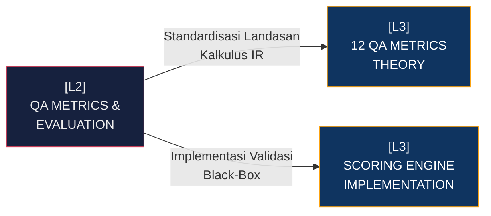

# [L2] SUB-SYSTEM: QA METRICS & EVALUATION ENGINE

Sub-sistem *QA Metrics & Evaluation Engine* (berada di bawah [[L1_STKI_CORE]]) adalah instrumen audit matematis berpresisi tinggi yang beroperasi terpisah dari inti pencarian *frontend*. Arsitektur ini menganggap mesin pencari hibrida sebagai *"Black Box"* (kotak hitam) yang mengemisikan matriks telemetri pencarian. Misi tunggal sistem L2 ini adalah menghitung tingkat validitas, reliabilitas, dan determinisme hasil (*Information Retrieval Output*) melawan *Ground Truth Benchmark* korpus akademik. 

Setiap interaksi evaluasi akan mengekstraksi metrik statistik deskriptif dan inferensial. Pendekatannya murni rasionalis—nol estetika antarmuka, bertumpu mutlak pada 12 matrikulasi skalar: *Precision, Recall, F1-Score, Mean Average Precision (MAP), Mean Reciprocal Rank (MRR), Normalized Discounted Cumulative Gain (NDCG), Bpref, R-Precision, Expected Reciprocal Rank (ERR), Mean First Relevant Rank (MFRR), Fall-out*, dan *Miss Rate*. Kalkulasi komprehensif ini memastikan sistem bebas dari halusinasi *False Positives* yang tidak wajar akibat kesalahan penyesuaian bobot *Fusion-Alpha*.

| Dimensi | Deskripsi Teknis | Dampak Arsitektural |
| :--- | :--- | :--- |
| **Pipeline Validasi** | Mesin *Ground Truth Cross-Reference* mengeksekusi 12 rumus QA pada vektor hasil. | Mengharuskan struktur database mempertahankan *Benchmark Mapping* tabel terpisah tanpa meracuni *Live Index*. |
| **Komputasi Logaritmik** | Penurunan pangkat relavansi posisional menggunakan logaritma biner (NDCG). | Mengorbankan minor siklus CPU pada *Back-Office Terminal* guna memaksa pembuktian sensitivitas urutan dokumen. |
| **Kriteria Holistik** | Integrasi *Fall-out* & *Miss Rate* berdampingan dengan MRR/MAP standar. | Mencegah anomali di mana *Recall* tinggi dicapai semata karena indeks memuntahkan dokumen *noise* massal. |

Keberadaan modul ini krusial sebagai jembatan pembuktian arsitektur kepada auditor eksternal. L2 ini mengontrol delegasi *Deep Dive* komputasi (L3) yang berisi parameterisasi matematis ketat dan implementasi *Python Native Logic* di sisi skoring, sehingga pergeseran algoritma pencarian di lapisan atas selalu tergambarkan sebagai deviasi skalar yang dapat diverifikasi ulang secara saintifik.

**Keterhubungan Graf (L3 Deep Dive Nodes):**
- [[L3_THEORY_QA_METRICS]]: Fondasi Teoretis 12 Metrik Evaluasi Sistem IR.
- [[L3_PRACTICE_SCORING_ENGINE]]: Kode Python & Implementasi Skoring Validasi Silang.

---
*Konteks: Bagian dari [[L1_STKI_CORE]]*
