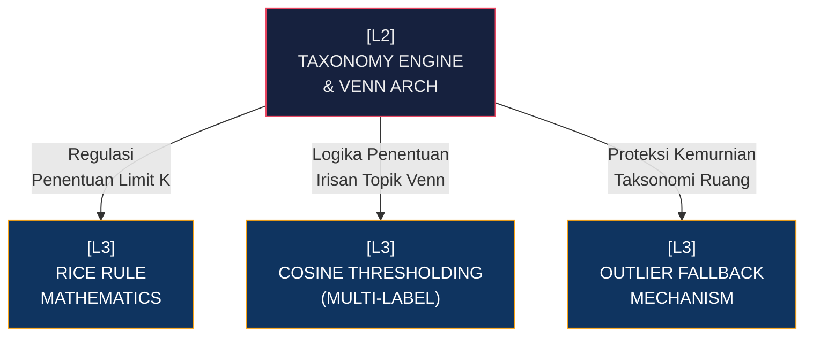

# [L2] SUB-SYSTEM: TAXONOMY ENGINE & VENN ARCHITECTURE

Berakar pada [[L1_DATA_SCIENCE]], *Taxonomy Engine* menghancurkan paradigma kategorisasi korpus ortodoks yang memaksakan satu dokumen hanya berdiam pada satu wadah klaster absolut (*Hard Clustering*). Sub-sistem ini memberlakukan arsitektur irisan berbasis himpunan (*Venn Architecture*), memungkinkan korpus memiliki ikatan taksonomi jamak yang bersifat probabilitas dinamis. Mesin tidak berasumsi bahwa sebuah paper ilmiah tentang "Natural Language Processing dalam Diagnosa Medis" eksklusif milik klaster "Informatika" tanpa probabilitas lintasan ke "Ilmu Kedokteran".

Proses otonom diinisialisasi melalui algoritma *K-Means Clustering* konvensional. Namun, ia diregulasi keras oleh *Rice Rule* untuk menentukan batasan ideal $K$, menghapuskan tebakan jumlah kelompok secara sewenang-wenang berdasarkan insting manusia. *K-Means* ini bukan pemberi label akhir, melainkan murni ekstraktor *Centroid Topic Space*. Entitas pelabel utama adalah komputator Cosine Thresholding yang menghitung deviasi dokumen individual terhadap setiap *Centroid* matriks penemuan awal.

| Dimensi | Deskripsi Teknis | Dampak Arsitektural |
| :--- | :--- | :--- |
| **Generasi Dimensi Takson** | Restriksi jumlah *Centroid* via Teorema Rice Rule ($X = \lceil 2 \cdot N^{1/3} \rceil$). | Otonomisasi penuh pada pipa analitik; mencegah partisi ekstrim (terlalu banyak/sedikit) tanpa iterasi komputasi ganda. |
| **Evaluasi Irirsan (Venn)** | Pengukuran skalar geometri jarak titik dokumen ke *N-Centroid* menggunakan parameter $\tau \ge 0.50$. | Mengakomodasi *Multi-Label Matrix* di level sistem, menggeser struktur penyimpanan RDBMS dari *One-to-Many* menjadi relasi graf bobot spasial. |
| **Sistem Proteksi Outlier** | *Graceful degradation* dengan mendegradasi anomali ber-kemiripan absolut rendah menuju klaster *Fallback*. | Memproteksi kemurnian sentroid (*Centroid Purity*); memastikan taksonomi inti tidak terdistorsi oleh korpus acak/anomali linguistik. |

Kompleksitas perhitungan *multi-label* mendelegasikan kebutuhan matematis absolut ke lapisan implementasi (L3). *Pipeline* wajib mengoptimalkan matriks numpy agar terhindar dari *out-of-memory errors* (OOM) ketika matriks dokumen menembus besaran $>100,000$ baris vektor dimensi tinggi. 

**Keterhubungan Graf (L3 Deep Dive Nodes):**
- [[L3_THEORY_RICE_RULE]]: Justifikasi Matematis $K$ Otonom berdasarkan distribusi populasi $N$.
- [[L3_PRACTICE_COSINE_THRESHOLDING]]: Logika komputasi jarak dinamis dan konversi probabilitas matriks Multi-Label.
- [[L3_PRACTICE_OUTLIER_FALLBACK]]: Mekanisme kondisional *Threshold* Penolakan.

---
*Konteks: Bagian dari [[L1_DATA_SCIENCE]]*
