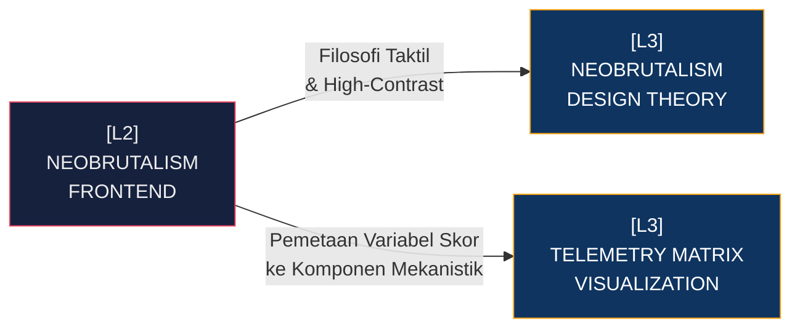

# [L2] SUB-SYSTEM: NEOBRUTALISM FRONTEND

Sub-sistem *Neobrutalism Frontend* meradikalisasi layer penyajian visual di bawah [[L1_STKI_CORE]]. Penolakan terhadap filosofi desain *Flat* atau *Skeuomorphism* diimplementasikan untuk memaksa audiens (baik *End-User* maupun *Data Scientist*) menghadapi kompleksitas data mentah tanpa filtes artifisial. *Neobrutalism* pada STKI memanfaatkan batas tebal (border stroke tinggi), palet monokromatik kontras tajam dengan aksen kromatis absolut, serta struktur komponen *rigid* yang merender hierarki probabilitas vektor menjadi artefak visual mekanistik. Keputusan arsitektural ini meminimalisir overhead CSS kompleks (efek *blur*, *shadows* multi-lapis) sekaligus memfokuskan atensi kognitif murni pada output *telemetry*.

Setiap komponen dirancang agar statis-namun-reaktif; interaksi divalidasi dengan transisi kaku yang memberi beban mikro pada *Render Tree* DOM. Dalam konteks sistem pengambilan temu kembali informasi (IR) berskala "BIG DATA", filosofi desain ini bertindak sebagai alat ukur visual: jika mesin belakang lambat, antarmuka depan akan langsung menonjolkan kekakuan *latency* tersebut, memaksakan doktrin *optimization-first* pada sisi *Back-End*.

| Dimensi | Deskripsi Teknis | Dampak Arsitektural |
| :--- | :--- | :--- |
| **Topologi Visual** | *Hard-border Grid Systems* dengan tipografi monospaced/sans-serif industrial. | Merender *Node Pipeline* dan *Telemetry Matrix* sebagai struktur *box-model* kaku tanpa reflow DOM tinggi. |
| **Kontrol Interaksi** | Transisi mekanistik (*Step-curves* atau transisi instan 50ms). | Menghilangkan fatamorgana latensi *smooth-scroll*; interaksi dikonfirmasi instan pasca *Callback* O(1) DB. |
| **Integrasi Data** | Pemetaan nilai Cosine Similarity langsung ke metrik *High-Contrast Badges*. | Skor *threshold* (misal $\tau > 0.85$) diinjeksikan secara reaktif memicu pergeseran state komponen tanpa *re-render* akar DOM. |

Implementasi di lapangan menuntut konversi logika dari *Information Retrieval* ke visualisasi matriks, memaksakan node L3 memikul eksposur tentang bagaimana variabel skalar diterjemahkan menjadi lebar telemetri progresif. 

**Keterhubungan Graf (L3 Deep Dive Nodes):**
- [[L3_THEORY_NEOBRUTALISM]]: Studi Filosofi & CSS *Utility* Neobrutalisme pada Big Data.
- [[L3_PRACTICE_TELEMETRY_MATRIX]]: Kode Integrasi dan Render *Cardinality* & Indikator Batas.

---
*Konteks: Bagian dari [[L1_STKI_CORE]]*
