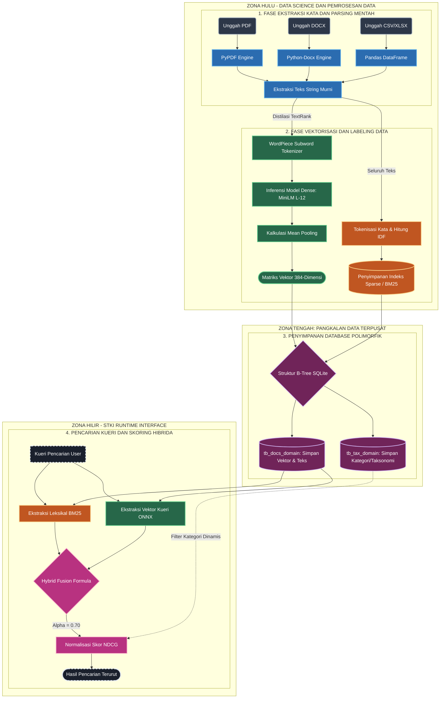

# [L0] SYSTEM JOURNEY MAP: SIKLUS HIDUP DATA

_Konteks: Peta Utama Navigasi Sistem STKI_

Dokumen ini memetakan perjalanan seutas teks sejak ia masih berupa dokumen mentah, hingga diproses oleh **Mesin Leksikal (Sparse)** dan **Mesin Semantik (Dense)**, lalu disimpan di pangkalan data sentral untuk temu kembali hibrida.

Gunakan peta ini saat presentasi untuk menjelaskan aliran data secara runut dan teknis. Ikuti alur dari atas ke bawah.

## Penjelasan Simpul Proses Berdasarkan Warna
1. **Abu-Abu Gelap (Input User)**: Berkas mentah yang dilempar pengguna tanpa pengolahan apapun.
2. **Biru (Parsing Engine)**: Entitas Python yang menelanjangi format dokumen hingga tersisa string teks murninya.
3. **Oranye (Mesin Leksikal BM25)**: Algoritma evolusi TF-IDF. Menghitung statistik probabilitas kemunculan huruf persis. Cocok menangkap akronim kaku.
4. **Hijau (Mesin Semantik Dense)**: *Neural Network* (MiniLM L-12 ONNX). Ia membaca arah kalimat, memotong kata ke unit subword, dan menyusutkannya jadi koordinat 384 dimensi untuk mencari sinonim dan kaitan makna.
5. **Ungu Tua (Central Database)**: SQLite Master yang memecah lalu-lintas data secara isolasi antar tabel (`tb_docs_{domain}`).
6. **Pink (Fusion Engine)**: Formula final yang memadukan kekuatan probabilitas leksikal dan geometri semantik.
