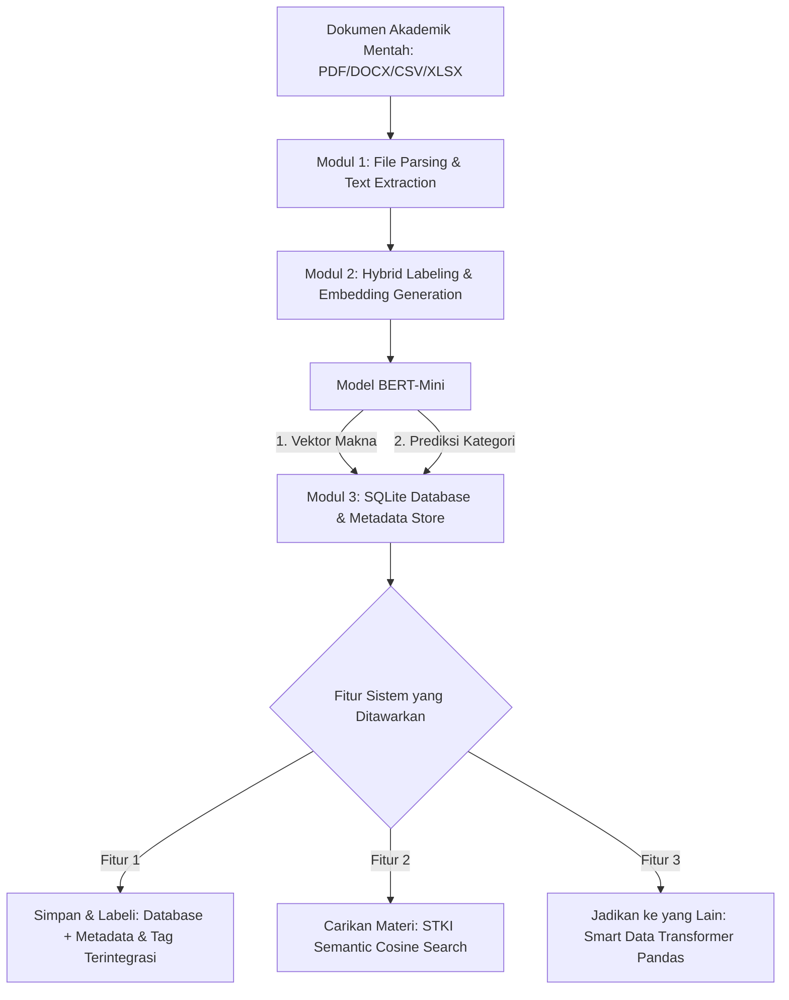
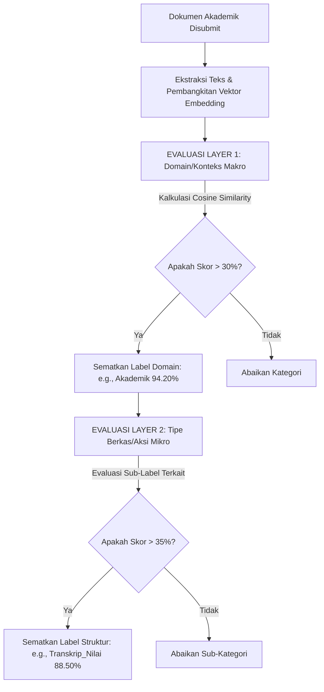

# Rencana Implementasi: Sistem Kecerdasan Dokumen Akademik
**Tahapan Eksperimen: TKT 3 (Data Science) & Persiapan TKT 4 (STKI)**

Dokumen ini menjelaskan peta jalan (roadmap), alur data, serta rencana integrasi sistem klasifikasi multi-label, pencarian semantik (STKI), dan sistem transformasi dokumen otomatis untuk civitas akademika.

---

## 1. Roadmap Sistem & Alur Kerja Utama

Sistem ini dirancang untuk menyelesaikan masalah manajemen dokumen di lingkungan kampus (civitas akademika). Alur kerja sistem terbagi menjadi tiga tahapan fungsional utama yang saling terhubung:

---

## 2. Rincian Tiga Fitur Utama (Civitas Akademika)

### Fitur 1: Simpan dan Labeli (Data Science & Database)
* **Deskripsi:** Dokumen akademik (seperti skripsi, transkrip nilai, jadwal kuliah) diunggah ke dalam sistem. Sistem mengekstrak teks mentah, memprosesnya melalui model BERT-mini, menghasilkan prediksi multi-label secara dinamis, dan menyimpannya ke dalam basis data terstruktur.
* **Alur Implementasi:**
  1. Pengguna mengunggah berkas mentah.
  2. Fungsi `extract_text_from_file` mendeteksi format berkas dan mengambil teksnya.
  3. Model memprediksi klasifikasi label dan menghasilkan vektor embedding.
  4. Berkas, metadata (nama berkas, tanggal), daftar label, dan vektor embedding disimpan bersama-sama ke dalam **SQLite Database** (`academic_metadata.db`).

### Modul Tambahan: Label Maker & Multi-Layer Dynamic Scorer
Untuk mewujudkan proses pelabelan yang dinamis dan transparan saat sidang demo, sistem dilengkapi dengan **Label Maker** otomatis. Modul ini langsung aktif mengalkulasi skor secara otomatis sesaat setelah berkas dikirim (*submitted*), baik untuk berkas tunggal (individual) maupun banyak berkas sekaligus (batch/bulk).

#### A. Mekanisme Penghitungan Otomatis Saat Submit
* **Submit Individual (Tunggal):**
  * Pengguna mengunggah satu berkas (misal: `proposal_budi.pdf`).
  * Sistem mengekstrak teks, melewatkannya ke model BERT, lalu membandingkannya dengan seluruh kandidat label secara paralel.
  * Sistem langsung menampilkan visualisasi skor kecocokan (*confidence score*) secara bertahap untuk masing-masing layer di antarmuka sistem.
* **Submit Batch/Bulk (Sekaligus/Banyak Berkas):**
  * Pengguna mengunggah beberapa dokumen sekaligus (misal: 10 berkas CSV & PDF).
  * Sistem memproses antrean dokumen secara asinkron menggunakan *queue processor*.
  * Hasil kalkulasi ditampilkan dalam bentuk tabel ringkasan pelabelan dengan kolom nama berkas, label Layer 1 (+Skor), dan label Layer 2 (+Skor).

#### B. Struktur Multi-Layer & Visualisasi Skor
Proses evaluasi dibagi menjadi 2 Layer independen dengan visualisasi skor kedekatan semantik (Cosine Similarity) yang sangat jelas:

* **Layer 1: Domain/Konteks Makro**
  Mengevaluasi keselarasan dokumen terhadap domain besar di lingkungan kampus.
  * *Contoh Visualisasi Skor:* `Akademik (94.20%)`, `Administrasi (45.10%)`, `Keuangan (12.30%)`.
  * *Hasil:* Hanya label di atas ambang batas 30% yang disematkan (`Akademik` & `Administrasi`).
* **Layer 2: Tipe Berkas/Aksi Mikro**
  Mengevaluasi struktur spesifik dokumen di bawah domain yang terpilih di Layer 1.
  * *Contoh Visualisasi Skor (di bawah Akademik):* `Transkrip_Nilai (88.50%)`, `Silabus_Kuliah (21.40%)`.
  * *Hasil:* Hanya label di atas ambang batas 35% yang disematkan (`Transkrip_Nilai`).

### Fitur 2: Carikan Materi yang Sesuai (Pencarian Semantik STKI)
* **Deskripsi:** Penguji atau pengguna dapat melakukan pencarian materi akademis yang relevan dengan memasukkan kueri atau dokumen pembanding. Sistem akan mencarikan kecocokan makna semantik, bukan sekadar kecocokan kata kunci mentah (*keyword matching*).
* **Alur Implementasi:**
  1. Pengguna memasukkan kueri teks pencarian (misal: "penelitian tentang kecerdasan buatan untuk mahasiswa").
  2. Kueri tersebut diubah menjadi vektor embedding menggunakan model BERT-mini yang sudah dilatih.
  3. Sistem menghitung tingkat kecocokan menggunakan **Cosine Similarity** terhadap seluruh dokumen yang tersimpan di dalam database SQLite.
  4. Sistem mengembalikan daftar dokumen paling mirip secara terurut dari tingkat kemiripan tertinggi ke terendah.

### Fitur 3: Jadikan ke yang Lain (Smart Data Transformer)
* **Deskripsi:** Merubah dokumen data mentah lengkap (seperti rekapan nilai perkuliahan mahasiswa atau daftar mata kuliah) menjadi bentuk laporan ringkasan/visualisasi data yang sangat berguna bagi pengambil kebijakan di kampus.
* **Alur Implementasi:**
  1. Pengguna memilih dokumen terdaftar yang bertipe data spreadsheet (CSV/XLSX).
  2. Sistem mengenali klasifikasi tipe berkas tersebut (misalnya terdeteksi label `Data_Mahasiswa_Lengkap` atau `Daftar_Mata_Kuliah`).
  3. Sistem menawarkan opsi transformasi dinamis:
     * *Opsi A:* Mengubah data lengkap mahasiswa menjadi perkembangan rata-rata IPK per semester.
     * *Opsi B:* Mengubah data lengkap menjadi daftar mata kuliah yang paling diminati mahasiswa.
  4. **Pandas Engine** mengeksekusi operasi agregasi, pivoting, dan pengurutan data untuk menghasilkan format berkas laporan baru yang siap didownload.

---

## 3. Rencana Pengujian & Validasi Demo Sidang

Untuk memastikan sistem Anda berjalan dengan sempurna dan memukau para dosen penguji saat presentasi:

| Skenario Uji | Berkas Masukan | Output yang Diharapkan | Validasi Keberhasilan |
|---|---|---|---|
| **Klasifikasi Dinamis** | File PDF Proposal Skripsi | Label: `Proposal_Skripsi`, `Kecerdasan_Buatan` | Model berhasil mendeteksi topik ilmiah dengan *confidence* > 80% meskipun file belum pernah masuk database. |
| **STKI Semantik** | Kueri: "kurikulum dan silabus baru" | Menampilkan berkas silabus perkuliahan yang diupload sebelumnya | Berkas silabus muncul di peringkat #1 pencarian meskipun dokumen tersebut tidak mengandung kata "silabus" secara literal (kecocokan semantik). |
| **Transformasi Data** | Berkas CSV Rekapitulasi Nilai 1 Semester | Laporan: Daftar mata kuliah dengan rata-rata nilai terendah dan tertinggi | Data mentah bertransformasi secara instan menjadi tabel agregasi terstruktur yang rapi dan siap saji. |
